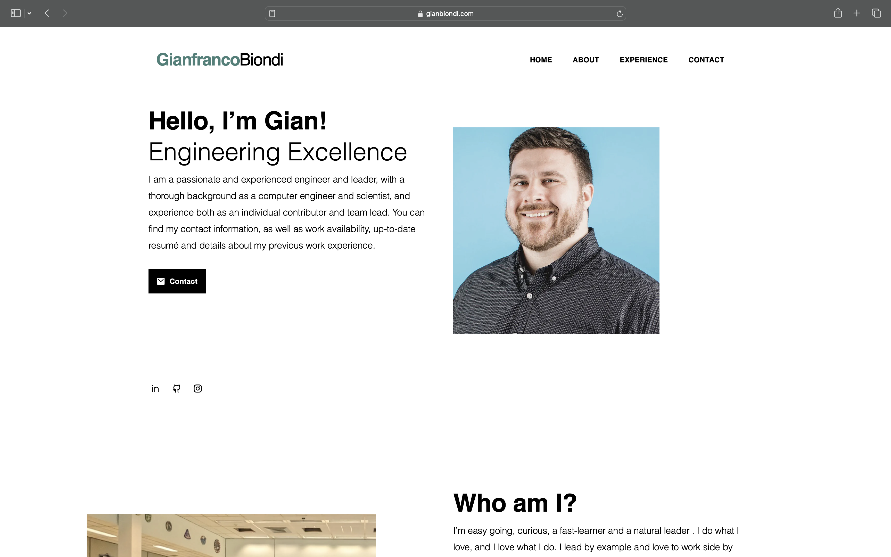

# gianbiondi.com

This repository holds the information, structure and design in [www.gianbiondi.com](http://www.gianbiondi.com).

### Design

You can find the template open sourced independently from this site in https://github.com/zetxek/adritian-free-hugo-theme.

### Generation

The content is generated with [Hugo](https://gohugo.io/), a very fast, flexible and tuneable static content generator. It's made with go, the first reason I started to play around with it - later I discovered its power and strong community.

#### Running locally

[Installing Hugo](https://gohugo.io/getting-started/installing/) is a pre-requirement.
After that, the commands from [Hugo CLI](https://gohugo.io/getting-started/usage/) can be used, like `hugo serve`.

### Deployment

The code in this repo is later procesed with [Github Actions](https://github.com/gxb5443/gianbiondi.com/actions) - which will generate the HTML with hugo, process the CSS, images and JS with gulp, and export the contents to Firebase Hosting.

As simple as it gets!
